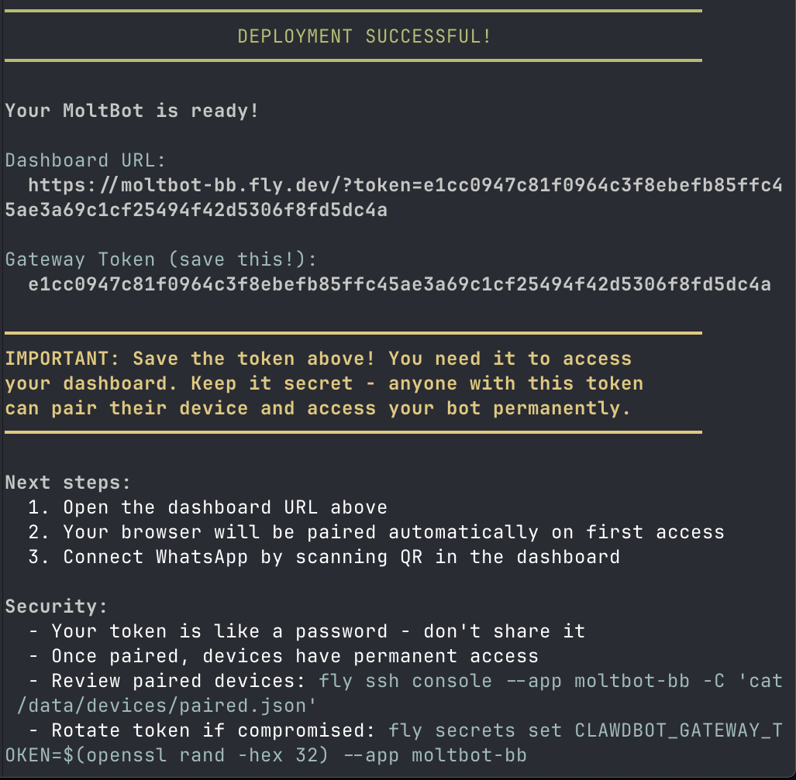

# MoltBot Cloud Deployment

Deploy your personal AI assistant (Claude or OpenAI) to the cloud in minutes.

## Supported Providers

| Provider | Status | Notes |
|----------|--------|-------|
| [Fly.io](https://fly.io) | Recommended | Free tier available |
| [DigitalOcean](https://digitalocean.com) | Supported | App Platform |

## Requirements

- [Anthropic API key](https://console.anthropic.com/settings/keys) **or** [OpenAI API key](https://platform.openai.com/api-keys)
- Cloud provider account (Fly.io or DigitalOcean)

> **Note:** The installer auto-installs `flyctl` or `doctl` CLI if missing.

## Cost Estimate

| Provider | Component | Monthly Cost |
|----------|-----------|-------------|
| **Fly.io** | VM (4GB RAM, 2 vCPU) | ~$22 USD |
| | Persistent volume (1GB) | ~$0.15 USD |
| | Dedicated IPv4 (optional) | $2 USD |
| | **Subtotal** | **~$22-25 USD** |
| **DigitalOcean** | App Platform (Basic) | ~$12 USD |
| | **Subtotal** | **~$12 USD** |
| **AI API** | Anthropic/OpenAI | Variable (pay per use) |

> MoltBot software is free and open source. You pay only for hosting and API usage.

---

## Quick Start (Automated)

Run this command to deploy MoltBot with an interactive installer:

```bash
curl -fsSL https://raw.githubusercontent.com/blissito/moltbot-flyio/main/install.sh | bash
```

The installer will:
1. Check requirements (git, openssl, jq) and auto-install CLI tools
2. Let you choose cloud provider (Fly.io or DigitalOcean)
3. Authenticate with your provider
4. Prompt for app name (auto-normalized to valid format), region, and API key
5. Let you choose AI provider (Anthropic or OpenAI) and model
6. Configure channels (WhatsApp, Telegram, Discord, Slack)
7. Create app, storage, and secrets
8. Deploy and configure the gateway
9. Output your dashboard URL and token



---

## MoltBot CLI (Post-Installation)

After installation, use the CLI to manage your bot:

```bash
curl -fsSL https://raw.githubusercontent.com/blissito/moltbot-flyio/main/moltbot-cli.sh | bash -s -- <command>
```

### Available Commands

| Command | Description |
|---------|-------------|
| `status` | Show app status and dashboard URL |
| `logs` | Stream live logs (Ctrl+C to exit) |
| `restart` | Restart the bot |
| `channels` | List enabled channels |
| `add-whatsapp` | Enable WhatsApp channel |
| `add-telegram` | Enable Telegram (prompts for token) |
| `add-discord` | Enable Discord (prompts for token) |
| `add-slack` | Enable Slack (prompts for token) |
| `remove-channel <name>` | Disable a channel |
| `config` | Show current configuration |
| `update` | Update MoltBot to latest version |

### Examples

```bash
# Check status
curl -fsSL .../moltbot-cli.sh | bash -s -- status

# Add Telegram channel
curl -fsSL .../moltbot-cli.sh | bash -s -- add-telegram

# View logs
curl -fsSL .../moltbot-cli.sh | bash -s -- logs

# Specify app name
curl -fsSL .../moltbot-cli.sh | bash -s -- status --app my-moltbot
```

### Local Usage

If you have the repo cloned:

```bash
./moltbot-cli.sh status
./moltbot-cli.sh add-telegram
./moltbot-cli.sh channels
```

> **Note:** The CLI requires `jq` for channel management. Install with `brew install jq` (macOS) or `apt install jq` (Linux).

---

## Manual Deployment

### Step 1: Clone this repository

```bash
git clone https://github.com/blissito/moltbot-flyio.git
cd moltbot-flyio
```

### Step 2: Authenticate with Fly.io

```bash
fly auth login
```

### Step 3: Create the app

```bash
# Choose a globally unique name
fly apps create your-app-name --org personal
```

### Step 4: Create persistent volume

```bash
fly volumes create moltbot_data --size 1 --region iad --app your-app-name --yes
```

**Regions:** `iad` (Virginia), `sjc` (San Jose), `lhr` (London), `gru` (Sao Paulo), `nrt` (Tokyo)

### Step 5: Configure fly.toml

Edit `fly.toml` and set your app name:

```toml
app = "your-app-name"  # <-- Change this
primary_region = "iad"  # <-- Change to your region
```

### Step 6: Set secrets

```bash
# Generate gateway token
export GATEWAY_TOKEN=$(openssl rand -hex 32)
echo "Your token: $GATEWAY_TOKEN"  # Save this!

# Set secrets
fly secrets set ANTHROPIC_API_KEY=sk-ant-api03-YOUR_KEY --app your-app-name
fly secrets set CLAWDBOT_GATEWAY_TOKEN=$GATEWAY_TOKEN --app your-app-name
```

> **Important:** Save the gateway token. You need it to access the dashboard.

### Step 7: Deploy

```bash
fly deploy --app your-app-name
```

Deployment takes ~2-3 minutes for the Docker image build.

### Step 8: Verify memory is 4GB

```bash
# Get machine ID
fly machines list --app your-app-name

# Verify or update memory (replace MACHINE_ID)
fly machine update MACHINE_ID --memory 4096 --app your-app-name --yes
```

> **Critical:** 2GB causes OOM errors. Always use 4GB.

### Step 9: Configure gateway

Connect via SSH:

```bash
fly ssh console --app your-app-name
```

Create the config file:

```bash
cat > /data/moltbot.json << 'EOF'
{
  "gateway": {
    "port": 3000,
    "bind": "lan",
    "controlUi": {
      "dangerouslyDisableDeviceAuth": true
    }
  },
  "agents": {
    "defaults": {
      "model": {
        "primary": "anthropic/claude-sonnet-4-5",
        "fallbacks": ["anthropic/claude-haiku-4-5"]
      }
    },
    "list": [{ "id": "main", "default": true }]
  },
  "auth": {
    "profiles": {
      "anthropic:default": { "mode": "token", "provider": "anthropic" }
    }
  },
  "channels": {
    "whatsapp": {
      "dmPolicy": "pairing",
      "sendReadReceipts": true,
      "textChunkLimit": 4000
    }
  },
  "plugins": {
    "entries": {
      "whatsapp": { "enabled": true }
    }
  }
}
EOF
exit
```

### Step 10: Restart to apply config

```bash
fly machines restart MACHINE_ID --app your-app-name
```

Wait ~30-40 seconds for restart.

### Step 11: Access the dashboard

Open in browser:

```
https://your-app-name.fly.dev/?token=YOUR_GATEWAY_TOKEN
```

---

## Deploy with Claude Code

Paste this prompt into Claude Code:

```
I want to deploy MoltBot to Fly.io.

My Anthropic API key is: [PASTE_YOUR_KEY]

Steps needed:
1. Clone moltbot-flyio repository
2. Create Fly.io app named [YOUR_APP_NAME]
3. Create 1GB volume for persistence
4. Configure secrets (ANTHROPIC_API_KEY and CLAWDBOT_GATEWAY_TOKEN)
5. Deploy with 4GB RAM (critical: 2GB causes OOM)
6. Configure moltbot.json with port 3000 and gateway token
7. Approve my device to access the dashboard

Notes:
- Gateway runs on port 3000, not the default 18789
- I need the token to access the dashboard
- I want to connect WhatsApp
```

---

## Connecting WhatsApp

Once in the dashboard, go to Channels and follow the QR code instructions.

Or via CLI:

```bash
fly ssh console --app your-app-name
node dist/index.js channels login
# Scan QR with WhatsApp > Settings > Linked Devices
```

---

## Troubleshooting

### Error 502 Bad Gateway

```bash
fly logs --app your-app-name --no-tail | tail -50
```

**Causes:**
- Gateway still starting (wait 30-40 seconds)
- OOM error (increase memory to 4GB)

### Out of Memory (OOM)

If logs show:
```
Out of memory: Killed process XXX
```

**Fix:**
```bash
fly machine update MACHINE_ID --memory 4096 --app your-app-name --yes
```

### Token Mismatch

The secret token must match `/data/moltbot.json`:

```bash
fly ssh console --app your-app-name --command "cat /data/moltbot.json"
```

### Pairing Required

If dashboard shows "pairing required" or error code 1008:

**Option 1: Disable device auth for cloud deployments (recommended)**

Edit `/data/moltbot.json` to include:
```json
{
  "gateway": {
    "controlUi": {
      "dangerouslyDisableDeviceAuth": true
    }
  }
}
```

Then restart: `fly machines restart MACHINE_ID --app your-app-name`

> **Note:** This is safe for cloud deployments. The gateway token still protects access. Device auth is primarily useful for local deployments where you want an extra layer of security.

**Option 2: Manual device approval**

```bash
fly ssh console --app your-app-name
node dist/index.js devices list
node dist/index.js devices approve REQUEST_ID
```

### Gateway Lock Issues

If gateway won't start with "already running" errors:

```bash
fly ssh console --command "rm -f /data/gateway.*.lock"
fly machine restart MACHINE_ID --app your-app-name
```

### Invalid Channel Tokens (Slack Crash)

If logs show `invalid_auth` errors and the gateway keeps restarting:

```
[slack] [default] starting provider
Error: An API error occurred: invalid_auth
INFO Main child exited normally with code: 1
```

**Cause:** Invalid Slack tokens crash the entire gateway. This is a known issue with Slack integration (Discord/Telegram handle invalid tokens gracefully).

**Fix:**
1. Remove invalid Slack secrets:
   ```bash
   fly secrets unset SLACK_BOT_TOKEN SLACK_APP_TOKEN --app your-app-name
   ```

2. Disable Slack in config:
   ```bash
   fly ssh console --app your-app-name
   # Edit /data/moltbot.json and set slack.enabled to false
   ```

3. Restart: `fly machines restart MACHINE_ID --app your-app-name`

**Token Format Reference:**
| Channel | Token Format |
|---------|-------------|
| Telegram | `123456789:ABC-DEF...` (numbers:alphanumeric) |
| Discord | Long base64-like string |
| Slack Bot | Starts with `xoxb-` |
| Slack App | Starts with `xapp-` |

---

## Useful Commands

```bash
# Status
fly status --app your-app-name

# Live logs
fly logs --app your-app-name

# SSH access
fly ssh console --app your-app-name

# Restart
fly machines restart MACHINE_ID --app your-app-name

# Update memory
fly machine update MACHINE_ID --memory 4096 --app your-app-name --yes
```

---

## Updates

```bash
# Pull latest
cd moltbot-flyio
git pull

# Redeploy
fly deploy --app your-app-name
```

---

## Security

- **Gateway token is like a password** - don't share it
- **Paired devices have permanent access** - review periodically
- **Review paired devices:**
  ```bash
  fly ssh console --app your-app-name --command "cat /data/devices/paired.json"
  ```
- **Rotate token if compromised:**
  ```bash
  fly secrets set CLAWDBOT_GATEWAY_TOKEN=$(openssl rand -hex 32) --app your-app-name
  ```

---

## Features

- **Multi-cloud**: Deploy to Fly.io or DigitalOcean
- **Multi-AI**: Choose between Anthropic (Claude) or OpenAI (GPT)
- **Multi-channel**: WhatsApp, Telegram, Discord, Slack
- **Auto-install**: CLI tools installed automatically if missing
- **Smart validation**: App names auto-normalized to valid format (e.g., "perroBot" becomes "perrobot")

## More Information

- [Full Fly.io documentation](https://docs.molt.bot/platforms/fly)
- [MoltBot main repository](https://github.com/moltbot/moltbot)
- [MoltBot documentation](https://docs.molt.bot)

---

## Author

Created by **[@blissito](https://github.com/blissito)** · [fixtergeek.com](https://fixtergeek.com)

If this helps you, consider [sponsoring](https://github.com/sponsors/blissito).
